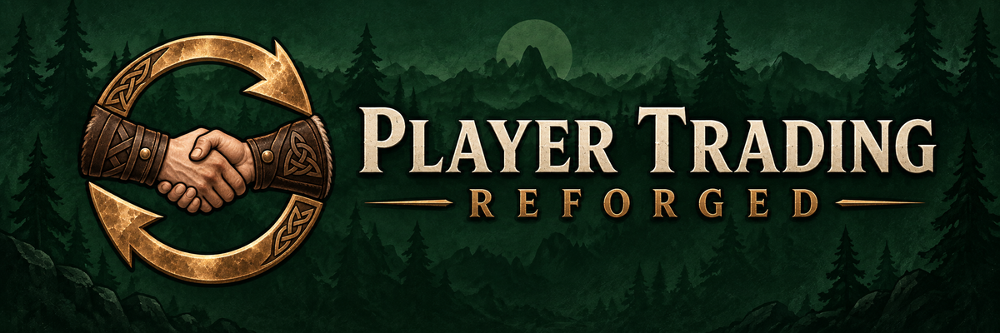

  

Trade with other players through familiar Valheim inventory windows. See each other’s items, equipped gear, and weight before and after the trade.

## How to trade

1. Interact with a nearby player. They interact with you to accept the request.
2. Place items in **You Will Give** and review **You Will Receive**.
3. Both players press **Accept Trade** to complete the exchange.

Offered items stay greyed out in both inventory previews. Changing an offer resets acceptance. **Cancel Trade** returns your items.

Supports stack splitting, quick move, and controllers. Press **F11** to reposition the windows.

## Install

Install through **r2modman** or **Thunderstore Mod Manager** with **BepInExPack_Valheim**. Both players need the same mod version; the server does not need it. Tested with Valheim **1.0.12**.

Custom items need matching mods on both clients. Only the main inventory is shared, including expanded main inventories. Separate equipment and backpack inventories are not shown.

If a trade is interrupted, make room for returned items or reconnect both characters to resolve it. See [recovery details](docs/RECOVERY.md).

## Credits & development

An independent rewrite of [projjm’s Player Trading](https://github.com/projjm/Valheim-Player-Trading), with fresh settings.

[Build instructions](docs/DEVELOPMENT.md) · [Test checklist](docs/TESTING.md) · [Changelog](CHANGELOG.md)
