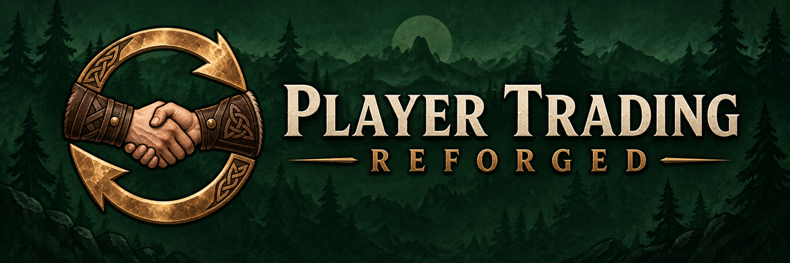

  

Trade with other players through familiar Valheim inventory windows. See each other’s items, equipped gear, and weight before and after the trade.

Interact with another player to request a trade. Add your items, then both press **Accept Trade**.

## Install

Install through **r2modman** or **Thunderstore Mod Manager**. Requires **BepInExPack_Valheim** and the same mod version on both players. No server install needed.

[Recovery help](docs/RECOVERY.md)

## Credits & development

A rewrite of [projjm’s Player Trading](https://github.com/projjm/Valheim-Player-Trading), with fresh settings.

[Build instructions](docs/DEVELOPMENT.md) · [Test checklist](docs/TESTING.md) · [Changelog](CHANGELOG.md)

## License

Original AugusDogus contributions are licensed under [MIT](LICENSE.md).
This grant excludes inherited upstream material and historical upstream commits;
the original Player Trading repository supplies no license grant.
See [third-party notices](package/THIRD-PARTY-NOTICES.md). The project is not
represented as wholly MIT-licensed while those permissions remain unresolved.
